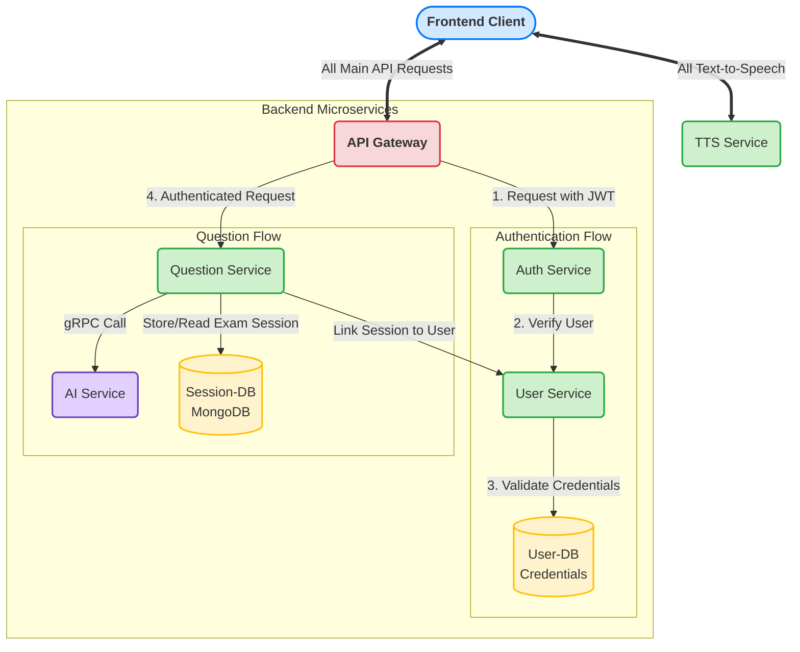

# DECODE

DECODE is a web platform that lets users practice mock interviews and improve their problem-solving skills. It provides fresh, unseen DSA questions and solves the underrated "notepad problem" where users can run code but are still expected to write working solutions. This ensures realistic practice for real interviews.

---

## Screenshots

*Add images of the DECODE platform here* 


---

## Tech Stack

- **Frontend:** React  
- **Backend:** Spring Boot  
- **Databases:** MongoDB, PostgreSQL  
- **AI Integration:** Gemini API
- **Service Communication:** gRPC, REST API  

---

## Architecture

DECODE consists of 8 microservices:

1. **API Gateway**  
2. **User Service**  
3. **User DB**  
4. **AI Service**  
5. **MongoDB**  
6. **Question Service**  
7. **Text-to-Speech Service**  
8. **Authentic Service**  

All services are containerized using Docker and stored on AWS ECR.

### System Architecture


### Architecture Flow

- API Gateway handles all incoming requests and routes them to the appropriate services.
- User Service manages user data and authentication.
- User DB stores relational data in PostgreSQL.
- AI Service integrates Gemini API for AI-driven question generation and assistance.
- MongoDB stores unstructured data, like user submissions and logs.
- Question Service serves coding questions dynamically.
- Text-to-Speech Service converts AI explanations or question instructions into audio.
- Authentic Service validates and manages service-level authentication.

All services communicate over a Docker network for isolation and easy deployment.

---

## Deployment Summary (From Local Machine → AWS ECR → EC2)

The deployment workflow for DECODE services follows these steps:

### 1. Build Docker Image (Locally)
Build the image of a service you want to deploy.  
**Example (User Service):**
```
Bash

docker build -t user-service:latest .
```
2. Tag the Docker Image for ECR
Tag the image so it matches your ECR repository format.
```
Bash

docker tag user-service:latest <AWS_ACCOUNT_ID>[.dkr.ecr.us-east-1.amazonaws.com/user-service:latest](https://.dkr.ecr.us-east-1.amazonaws.com/user-service:latest)
```
3. Push the Image to AWS ECR
Login and push the image:
```
Bash

aws ecr get-login-password --region us-east-1 | docker login --username AWS --password-stdin <AWS_ACCOUNT_ID>.dkr.ecr.us-east-1.amazonaws.com
docker push <AWS_ACCOUNT_ID>[.dkr.ecr.us-east-1.amazonaws.com/user-service:latest](https://.dkr.ecr.us-east-1.amazonaws.com/user-service:latest)
```
4. Connect to Your EC2 Instance
```
Bash

ssh ec2-user@<EC2_PUBLIC_IP>
```
5. Pull the Image on EC2
```
Bash

docker pull <AWS_ACCOUNT_ID>[.dkr.ecr.us-east-1.amazonaws.com/user-service:latest](https://.dkr.ecr.us-east-1.amazonaws.com/user-service:latest)
```
6. Create a Docker Network (Only Once)
```
Bash

docker network create decode-network
```
7. Run the Database Container (for example PostgreSQL)
```
Bash

docker run -d \
  --name user-service-db \
  --network decode-network \
  -p 5432:5432 \
  -e POSTGRES_USER=mockuser \
  -e POSTGRES_PASSWORD=mockpass \
  -e POSTGRES_DB=mockdb \
  <AWS_ACCOUNT_ID>[.dkr.ecr.us-east-1.amazonaws.com/user-service-db:latest](https://.dkr.ecr.us-east-1.amazonaws.com/user-service-db:latest)
```
8. Run the User Service Container and Link to DB
```
Bash

docker run -d \
  --name user-service \
  --network decode-network \
  -p 4000:4000 \
  -e SPRING_DATASOURCE_URL=jdbc:postgresql://user-service-db:5432/userdb \
  -e SPRING_DATASOURCE_USERNAME=useradmin \
  -e SPRING_DATASOURCE_PASSWORD=secretpass \
  <AWS_ACCOUNT_ID>[.dkr.ecr.us-east-1.amazonaws.com/user-service:latest](https://.dkr.ecr.us-east-1.amazonaws.com/user-service:latest)
Note: Follow the same pattern to deploy other services:
```
